# Multimodal Gemini Indexing & Visual DocC Previews — Design Spec

## 1. Overview & Intent

`gemini-embedding-2` natively maps text and image pixels into the exact same 3072-dimensional vector space. In Apple's Developer Documentation, diagrams, layout previews, and Human Interface Guidelines (HIG) screenshots carry critical architectural context that text alone misses.

This specification designs the multimodal upgrade for `apple-doc-plugin`:

1. **Multimodal Media Ingestion**: Ephemerally downloads Apple layout preview images and diagrams during indexing, embeds their pixels alongside captions into the unified 3072-dimensional space, and stores the resulting vector + Apple CDN URL into SQLite.
2. **Compact Database Schema**: Stores only the 3072-float vector and image CDN URL (`https://developer.apple.com/tutorials/images/...`), preventing binary image bloat in SQLite.
3. **Multimodal Search & Presentation**: AI agents (Claude, Gemini, Cursor) querying via text or intent receive matching visual previews inline in markdown (``), allowing multimodal reasoning on Apple UI components.

---

## 2. Architecture & Data Flow

```mermaid
flowchart TD
    subgraph Build Time
        A[Apple DocC JSON] --> B[indexer.ts Media Extractor]
        B --> C[Fetch Image Ephemerally]
        C --> D["gemini-embedding-2 Multimodal API<br>(text + inlineData base64)"]
        D --> E["3072-float Vector"]
        E --> F["SQLite semantic_items<br>(vector + CDN URL)"]
    end

    subgraph Runtime MCP Query
        Q[Agent Query: 'staggered two column layout'] --> S[Gemini Query Vector]
        S --> M[Cosine Similarity against Visual Vectors]
        M --> R[RRF Ranking with FTS5]
        R --> P["MCP Output Payload with<br>Swift Signature + ![Visual Preview](CDN URL)"]
    end
```



---

## 3. Database Schema Migration

Add `media_url`, `media_type`, and `caption` to `semantic_items`:

```sql
CREATE TABLE IF NOT EXISTS semantic_items (
    id TEXT PRIMARY KEY,
    framework TEXT NOT NULL,
    title TEXT NOT NULL,
    kind TEXT NOT NULL,            -- "guide", "technology", "primary_type", "diagram", "ui_preview"
    summary TEXT NOT NULL,
    path TEXT NOT NULL,
    media_url TEXT,                -- Apple CDN URL e.g. "https://developer.apple.com/tutorials/images/..."
    media_type TEXT,               -- "image/png", "image/jpeg", "video/mp4"
    embedding BLOB NOT NULL        -- 3072 float32 bytes
);
```

---

## 4. MCP Output Contract

When a symbol or guide match contains an associated `media_url`:

```markdown
### NavigationSplitView (SwiftUI)

• **Kind:** struct
• **Path:** /documentation/swiftui/navigationsplitview
• **Platforms:** iOS 16.0+, macOS 13.0+
A view that presents views in two or three columns.


```
